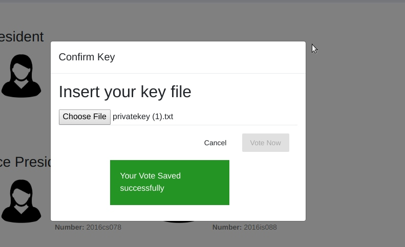

# online_voting_system
online voting system for Union election 

This sytem Implemented Using MEAN stack
used Twillo for send otp and used digital signatures for student Authendication and prevent man in the middle attacks

**registration**

**Login**

**First before vote voter need to get privatekey**

**Voter need to put key file Before Voting 
if the key is right vote is success** 

**How It works**
first student generate RSA key pair student download private key and public key will save in the database
When voting happen after submit the vote we get hash value of it and encript with voter's private key and get digital signature.then we send digital signature and original vote to the server.
In the server we get the digital signature and we decript it using voter public key.we can get hash value .now we use the same hashing algorithm to original vote. and compare two hashes . if the hash match vote is valid 

**election remaining time**

**After Election Student can see election result** 

